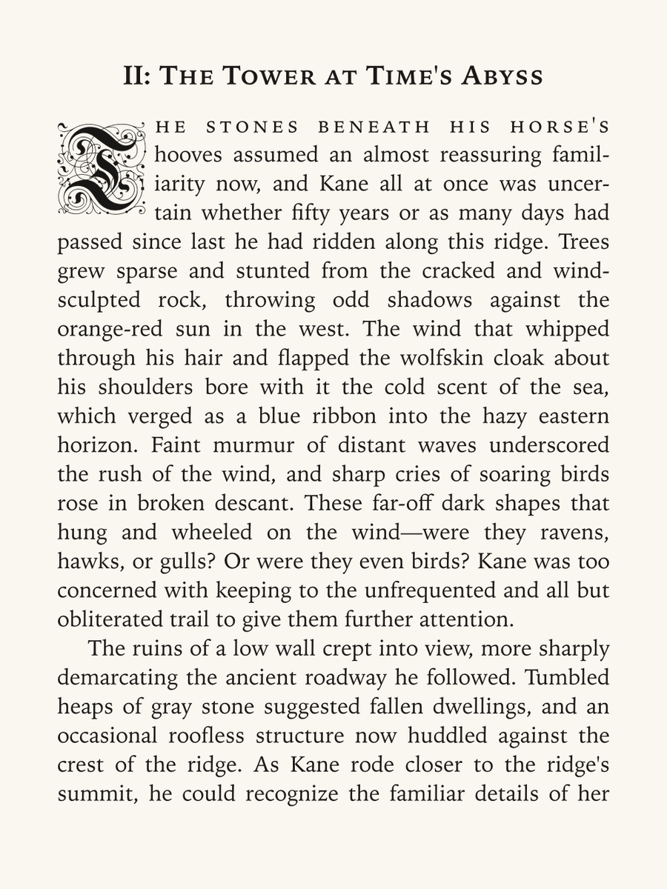
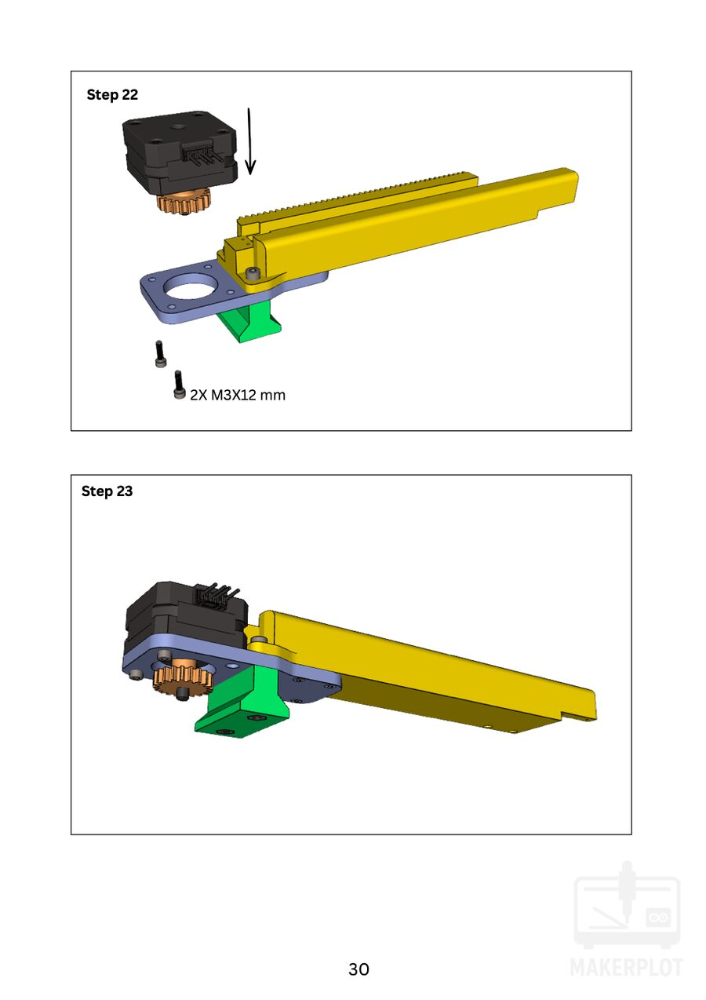
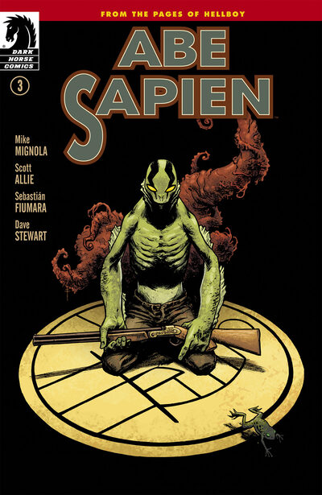

# ep

A terminal reader for epubs, PDFs and comics, using the kitty graphics
protocol. Works in tmux. Requires a modern terminal, such as ghostty.

## Build

```sh
make
make install          # $HOME/.local/bin, plus a cbr symlink
```

Needs a C compiler and zlib. `libjpeg-turbo` is picked up if present and is
most of the speed on comics and PDFs.

Pages are drawn with the kitty graphics protocol, so PDFs and comics need
kitty or Ghostty. Inside tmux, also `tmux set -g allow-passthrough all`.

## Use

```sh
ep book.epub
ep guide.pdf
ep comic.cbz
ep ~/books              # browse
ep --resume             # pick up where you left off
```

`?` shows the keys.

## Unpacking comics

Archives are unpacked with whichever of `bsdtar`, `unar` or `7z` is on `PATH`.
`bsdtar` is libarchive, which reads rar as well as zip, so a `.cbr` needs no
separate unrar. macOS ships it at `/usr/bin/bsdtar`; on Linux it is
`libarchive-tools`.

## PDFs off macOS

macOS renders PDFs and typesets epubs with CoreGraphics and CoreText, and needs
nothing installed. Elsewhere epubs fall back to text, and PDFs go through the
first of these that is present:

    poppler-utils    pdfinfo, pdftoppm
    mupdf-tools      mutool
    ghostscript      gs

All three are looked up on `PATH` at runtime, so none is a build dependency and
any one of them is enough. Building with `-DPDF_FORCE_TOOLS` takes this path on
macOS too, which is how it gets tested.

## epub

Uses kitty graphics and CoreText to render by default: drop caps, small caps, hyphenation and
justification. Press `T` or use `--text` for text mode. `d` toggles light/dark
mode.



## PDF



## comics

`.cbr`, `.cbz`, `.cb7`, `.cbt`, or a directory of page images. `f` toggles
panel mode. `tab` opens a thumbnail grid.


